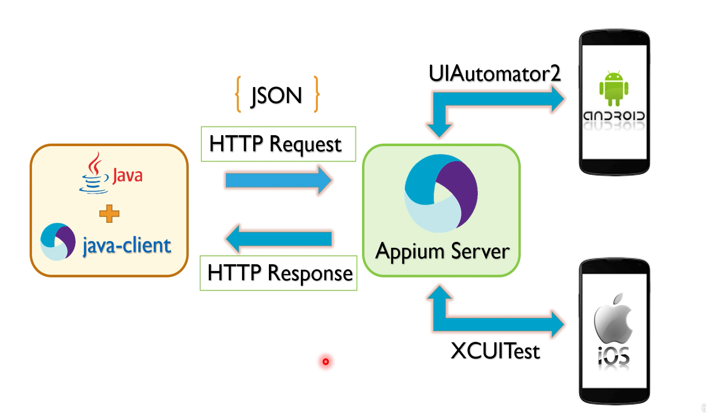

###### - 민시우(2025/03/10) 작성 -

## 1w-3. 🚀 Appium 학습 가이드

### [1-1] Appium 세팅(Win 11)

- [Node.js 다운로드](https://nodejs.org/en/download)
- [Java 17 다운로드](https://www.oracle.com/java/technologies/downloads/?er=221886)
- [Android 다운로드](https://developer.android.com/studio)
- [appium-inspector 다운로드](https://github.com/appium/appium-inspector/releases)

  

  1. Android SDK Build-Tools
  2. Android SDK Commoan-line Tools
  3. Android Emulator
  4. Android SDK Platform-Tools
  5. HAXM

#### 세팅 순서

1. Emulator
2. Real Device
3. Create Android Virtual Device
4. Enable USB Debugging on Real Device
5. Create new Driver session

#### 환경변수 설정

- [Win]+[R] sysdm.cpl

- ANDROID_HOME / C:\Users\Shiverlog\AppData\Local\Android\Sdk
- JAVA_HOME / D:\Program Files\Java\jdk-17
- Path 추가 값

  ```
  %JAVA_HOME%\bin
  C:\Users\Shiverlog\AppData\Roaming\npm
  %ANDROID_HOME%\platform-tools
  %ANDROID_HOME%\emulator
  %ANDROID_HOME%\cmdline-tools\latest\bin
  %ANDROID_HOME%\build-tools\35.0.1
  ```

- Appium 관련 설치

  ```sh
  # Appium 설치
  npm install -g appium

  # Android 드라이버 (UIAutomator2) 설치
  appium driver install uiautomator2

  # WebDriver 설치
  npm install -g webdriverio
  npm install --save-dev @types/webdriverio

  # Appium 실행
  npx appium

  # Appium Doctor 설치
  npm install -g appium-doctor

  # VS Code에서 환경 변수 다시 로드
  refreshenv
  ```

- Appium 설치확인 및 버젼확인

  ```sh
  # node / npm / JDK / Appium 버젼확인
  node -v
  npm -v
  java --version
  appium -v
  appium-doctor

  # Appium 드라이버 리스트 확인
  appium driver list
  # ✔ Listing available drivers
  # - xcuitest@8.4.2 [installed (npm)]
  # - uiautomator2@4.1.1 [installed (npm)]
  # - espresso [not installed]
  # - mac2 [not installed]
  # - windows [not installed]
  # - safari [not installed]
  # - gecko [not installed]
  # - chromium [not installed]
  ```

#### Android Emulator 가속을 위해 필요한 하이퍼바이저(가상화 기술) 선택

| 항목               | Hypervisor Driver for AMD Processor                                                            | HAXM Installer                                                |
| ------------------ | ---------------------------------------------------------------------------------------------- | ------------------------------------------------------------- |
| **대상 CPU**       | AMD 프로세서 (Windows)                                                                         | Intel 프로세서 (Windows, macOS)                               |
| **가속 기술**      | Windows Hypervisor Platform (WHPX)                                                             | Intel VT-x (Virtualization Technology)                        |
| **운영체제**       | Windows 전용                                                                                   | Windows, macOS                                                |
| **설치 방법**      | `Android Emulator Hypervisor Driver for AMD Processors` 패키지 설치                            | `Intel HAXM` 패키지 설치                                      |
| **기본 제공 여부** | Android SDK에서 제공됨                                                                         | Android SDK에서 제공됨 (단, macOS는 수동 설치 필요)           |
| **필요한 설정**    | - Windows Hypervisor Platform(WHPX) 활성화 <br> - BIOS에서 SVM (Secure Virtual Machine) 활성화 | - BIOS에서 VT-x 활성화 <br> - macOS에서는 커널 확장 허용 필요 |

#### `ADB 데몬 (ADB Daemon)`



- ADB (Android Debug Bridge) 데몬은 ADB 서버와 ADB 클라이언트 간의 통신을 처리하는 백그라운드 프로세스로써, 안드로이드 기기와 PC 간의 디버깅 및 파일 전송 등을 가능하게 하는 도구이다.

  1.  PC ↔ 안드로이드 기기 간 통신을 중계
  2.  ADB 명령을 기기에서 실행하도록 처리
  3.  파일 전송, 로그 확인, 앱 설치/제거 등의 작업 수행

- Device 설정

  1. And 개발자 모드 활성화: Settings > About phone > Software infornation > Build number 7회 연속 터치하여 활성화
  2. iOS 개발자 모드 활성화: Settings > Privacy & Security > Developer Mode > Turn On Developer Mode 후 리부팅하여 활성화
  3. Developer options > USB debugging 활성화

- ADB 서버 구동

  ```sh
  # ADB 서버 시작
  adb start-server

  # ADB 서버 종료
  adb kill-server

  # ADB 데몬을 루트 권한으로 실행
  adb root

  # ADB 데몬을 일반 사용자 권한으로 실행
  adb unroot

  # ADB 데몬을 TCP/IP 모드로 실행 (원격 디버깅)
  adb tcpip 5555

  # ADB 데몬 다시 시작
  adb kill-server
  adb start-server

  # PC에 연결된 안드로이드 기기의 목록을 확인
  adb devices
  ```

#### `AVD(Android Virtual Device)`

- Android Emulator에서 실행되는 가상 안드로이드 기기
- Android Studio > Configure > AVD Manager > Create Virtual Device > Select Model > Download Image for desired OS version if not already downloaded > Start AVD , Create Driver Session using Appium Desktop

#### `Appium Inspector`

- Appium을 사용하여 모바일 앱 및 웹 앱을 테스트할 때, UI 요소를 시각적으로 확인하고 XPath, ID, Accessibility ID 등으로 요소를 찾을 수 있도록 도와주는 도구
- Tools > Device Manager > Create Device

#### `Vysor`

- 주요 기능: Android 화면 미러링, 마우스/키보드 컨트롤, 화면 녹화 및 스크린샷, 원격 디버깅
- 지원 플랫폼: Windows, macOS, Linux, Chrome Extension

---

### [1-2] Appium 세팅(mac)

- [Homebrew 다운로드](https://brew.sh/ko/)

  ```zsh
  # Homebrew 설치
  /bin/bash -c "$(curl -fsSL https://raw.githubusercontent.com/Homebrew/install/HEAD/install.sh)"

  # node 설치
  brew instasll node

  # npm 설치
  npm install -g appium@next

  # appium 명령어 설명
  appium -h

  # 그 외 Win과 동일하게 세팅 진행

  # HAXM 설치
  brew install install intel-haxm

  # 환경변수 설정
  cd ~/
  open -e .zshrc
  export ANDROID_HOME=${HOME}/Library/Android/sdk
  export PATH="${ANDROID_HOME}/platform-tools:${ANDROID_HOME}/cmdline-tools:${PATH}"
  source .zshrc
  echo $ANDROID_HOME
  echo $PATH

  # iOS 드라이버 (XCUITest) 설치 (Mac 필요)
  appium driver install xcuitest
  ```

#### `Xcode`

- macOS에서 iOS 및 macOS 애플리케이션을 개발하고 테스트하기 위한 Apple의 공식 개발 도구
- Mac App Store > xcode
- Apple ID 로그인: Xcode → Preferences → "Accounts" 탭 → Apple ID 추가
- Preferences > Accounts > Manage Certificates에서 인증서 생성

  ```zsh
  # Xcode 명령어 도구 설치
  xcode-select --install

  # xcpretty 설치 (Xcode 빌드 로그 가독성 향상)
  gem install xcpretty

  # Xcode 설치 확인
  xcodebuild -version

  # Xcode 명령어 도구 확인
  xcode-select -p

  # Appium 서버 실행 및 세션 생성
  appium server --driver-xcuitest-webdriveragent-port 8101
  ```

### [1-3] Appium Driver Management

#### 드라이버 목록 확인

| 명령어                           | 설명                                |
| -------------------------------- | ----------------------------------- |
| `appium driver list`             | 설치 가능한 모든 드라이버 목록 표시 |
| `appium driver list --installed` | 현재 설치된 드라이버 목록 표시      |
| `appium driver list --updates`   | 업데이트 가능한 드라이버 목록 표시  |

#### 드라이버 설치

| 명령어                                                                   | 설명                                                          |
| ------------------------------------------------------------------------ | ------------------------------------------------------------- |
| `appium driver install <official_driver_name>`                           | 특정 드라이버 설치 (예: `appium driver install uiautomator2`) |
| `appium driver install <official_driver_name>@<specific_version_number>` | 특정 버전의 드라이버 설치                                     |
| `appium driver install --source <source> --package <name>`               | 특정 소스에서 드라이버 설치                                   |

#### 드라이버 소스 옵션

```sh
# NPM에서 공식 드라이버 설치
appium driver install --source npm appium-uiautomator2-driver

# GitHub에서 직접 설치
appium driver install --source git https://github.com/appium/appium-uiautomator2-driver.git --package appium-uiautomator2-driver

# GitHub (Appium 공식 저장소)에서 설치
appium driver install --source github appium/appium-uiautomator2-driver --package appium-uiautomator2-driver
```

---

### [2] 🚀 웹뷰(WebView)와 네이티브 뷰(Native View) 개념 및 웹 인증 프로세스

- ChromeCustomTab (Android) : Android 4.3 이상에서 OAuth/OpenID Connect 인증을 웹 기반으로 실행할 때 사용

- ASWebAuthenticationSession (iOS) : iOS 12 이상에서 OAuth/OpenID Connect 인증을 위한 공식 API, Safari 기반 인증을 실행하고, 로그인 후 앱으로 자동 복귀 가능

- `웹뷰(WebView)`: 네이티브 앱 내부에서 웹 페이지를 로드할 수 있도록 하는 임베디드 브라우저

  1. 내부적으로 HTML, CSS, JavaScript로 구성된 웹 페이지를 렌더링
  2. 웹 페이지가 포함되어 있기 때문에, 이를 처리하려면 컨텍스트(Context) 전환이 필요
  3. Android에서는 WebView, iOS에서는 WKWebView 또는 UIWebView를 사용하여 구현

  ```ts
  // 현재 사용 가능한 모든 컨텍스트 가져오기
  const contexts = await driver.getContexts();

  // 웹뷰 컨텍스트로 전환
  await driver.switchContext(contexts.find(ctx => ctx.includes('WEBVIEW')));

  // 웹 요소 조작
  const webElement = await driver.findElement('css selector', '#login-button');
  await webElement.click();

  // 다시 네이티브 컨텍스트로 전환
  await driver.switchContext('NATIVE_APP');
  ```

- `네이티브 뷰(Native View)`: 모바일 운영체제(Android/iOS)가 제공하는 네이티브 UI 컴포넌트를 의미

  1. Android의 UI 프레임워크: View
     - Android의 UI는 View 계층 구조(View Hierarchy)를 기반으로 동작한다.
     - 화면에 표시되는 모든 UI 요소(버튼, 입력 필드, 텍스트 등)는 View 클래스를 상속받는다.
     - 레이아웃(XML 또는 코드로 작성) → View 계층 구조에 배치 → 실제 화면에 렌더링한다.
  2. iOS의 UI 프레임워크: UIKit

     - iOS의 화면은 UIView 계층 구조(UIView Hierarchy)를 기반으로 동작한다.
     - 화면에 표시되는 모든 UI 요소(버튼, 입력 필드, 레이블 등)는 UIView를 상속받는다.
     - Storyboard/XIB 또는 코드 작성 → UIView 계층 구조에 추가 → 실제 화면에 렌더링한다.

  3. 운영체제의 UI 프레임워크(Android의 View, iOS의 UIKit)를 사용하여 렌더링된 화면, Appium에서는 네이티브 뷰 요소를 찾을 때 UiAutomator2 (Android)와 XCUITest (iOS) 엔진을 사용한다.

  ```ts
  // Android에서 네이티브 요소 찾기 (ID 사용)
  const element = await driver.findElement("id", "com.example.app:id/button");
  await element.click();

  // iOS에서 네이티브 요소 찾기 (Accessibility ID 사용)
  const element = await driver.findElement("accessibility id", "login_button");
  await element.click();
  ```

---

### [3] 🔍 개발자도구에서 디버깅

1. Android: Chrome DevTools에서 디버깅

   - chrome://inspect/#devices
   - WebView 디버깅을 위해 앱 코드에서 setWebContentsDebuggingEnabled(true) 추가

2. iOS: Safari 개발자 도구에서 디버깅

   - Settings > Safari > Advanced > Web Inspector 활성화
   - Safari > Preferences > Advanced > Show Develop menu in menu bar 체크

---

### [4] 📌 Execution Context(명시적 대기 조건 EC)

| 조건명                              | 설명                                                      |
| ----------------------------------- | --------------------------------------------------------- |
| **presenceOfElementLocated**        | 요소가 DOM에 존재할 때까지                                |
| **presenceOfAllElementsLocatedBy**  | 특정 요소가 여러 개 존재할 때까지                         |
| **visibilityOfElementLocated**      | 요소가 DOM에 존재하며 화면에 표시될 때까지                |
| **visibilityOf**                    | 주어진 요소가 화면에 표시될 때까지                        |
| **invisibilityOfElementLocated**    | 요소가 화면에서 사라질 때까지                             |
| **invisibilityOf**                  | 주어진 요소가 화면에서 사라질 때까지                      |
| **stalenessOf**                     | 요소가 더 이상 유효하지 않을 때까지                       |
| **elementToBeClickable**            | 요소가 클릭 가능해질 때까지                               |
| **elementToBeSelected**             | 요소가 선택될 때까지                                      |
| **elementSelectionStateToBe**       | 요소의 선택 상태가 특정 값과 일치할 때까지                |
| **numberOfElementsToBe**            | 특정 개수만큼 요소가 존재할 때까지                        |
| **numberOfElementsToBeMoreThan**    | 특정 개수보다 많아질 때까지                               |
| **numberOfElementsToBeLessThan**    | 특정 개수보다 적어질 때까지                               |
| **textToBePresentInElement**        | 특정 요소의 텍스트가 특정 값과 일치할 때까지              |
| **textToBePresentInElementLocated** | 특정 요소의 텍스트가 특정 값과 일치할 때까지              |
| **textToBePresentInElementValue**   | 특정 요소의 `value` 속성이 특정 값과 일치할 때까지        |
| **attributeToBe**                   | 특정 요소의 속성이 특정 값과 일치할 때까지                |
| **attributeContains**               | 특정 요소의 속성이 특정 값을 포함할 때까지                |
| **titleIs**                         | 현재 페이지의 제목이 특정 값과 일치할 때까지              |
| **titleContains**                   | 현재 페이지의 제목이 특정 값을 포함할 때까지              |
| **urlToBe**                         | 현재 URL이 특정 값과 일치할 때까지                        |
| **urlContains**                     | 현재 URL이 특정 값을 포함할 때까지                        |
| **frameToBeAvailableAndSwitchToIt** | 특정 프레임이 사용 가능해질 때까지                        |
| **numberOfWindowsToBe**             | 열린 브라우저 탭(윈도우) 개수가 특정 개수와 일치할 때까지 |
| **alertIsPresent**                  | 경고창(Alert)이 나타날 때까지                             |
| **and**                             | 여러 개의 조건을 모두 만족할 때까지                       |
| **or**                              | 여러 개의 조건 중 하나라도 만족하면 종료                  |
| **not**                             | 특정 조건이 충족되지 않을 때까지                          |
| **elementAttributeToBe**            | 요소의 특정 속성이 지정된 값과 일치할 때까지              |
| **elementAttributeContains**        | 요소의 특정 속성이 특정 값을 포함할 때까지                |
| **elementTextMatches**              | 특정 요소의 텍스트가 정규식(Regex)과 일치할 때까지        |
| **elementStyleToBe**                | 요소의 스타일 속성이 특정 값과 일치할 때까지              |
| **windowHandlesCountToBe**          | 열린 브라우저 창 개수가 특정 개수일 때까지                |
| **elementCssPropertyToBe**          | 특정 요소의 CSS 속성이 특정 값과 일치할 때까지            |
| **networkIdle**                     | 네트워크 요청이 일정 시간 동안 없을 때까지                |

```

```

---

### [5] 참고자료

Appium 2.0 공식 문서 및 리소스

- [Appium 2.0 Overall Documentation](https://appium.github.io/appium/docs/en/2.0/)
- [Appium GitHub Repository](https://github.com/appium)
- [Appium GitHub Issues Page (버그 신고)](https://github.com/appium/appium/issues)
- [Appium Inspector](https://github.com/appium/appium-inspector)
- [Driver Ecosystem](https://appium.github.io/appium/docs/en/2.0/ecosystem/)

Android (UiAutomator2) 관련 문서

- [UiAutomator2 Driver Documentation](https://github.com/appium/appium-uiautomator2-driver)
- [Android UiAutomator2 Capabilities](https://github.com/appium/appium-uiautomator2-driver#capabilities)

iOS (XCUITest) 관련 문서

- [XCUITest Driver Documentation](https://github.com/appium/appium-xcuitest-driver)
- [iOS XCUITest Capabilities](https://github.com/appium/appium-xcuitest-driver#capabilities)
- [iOS Real Device Setup](https://github.com/appium/appium-xcuitest-driver/blob/master/docs/real-device-config.md)

Appium 클라이언트 및 API 샘플

- [Java Client (버그 신고 및 업데이트)](https://github.com/appium/java-client)
- [API Demos App (Android 샘플 앱)](https://github.com/appium/appium/blob/master/packages/appium/sample-code/apps/ApiDemos-debug.apk)
- [UIKitCatalog App (iOS 샘플 앱)](https://github.com/appium/ios-uicatalog)
- [SauceLabs Demo App](https://github.com/saucelabs/sample-app-mobile)

Appium 확장 기능 및 하이브리드 앱 자동화

- [Driver Management Commands - Extension CLI](https://appium.github.io/appium/docs/en/2.0/cli/extensions/)
- [Hybrid App Automation](https://appium.io/docs/en/writing-running-appium/web/hybrid/)

Appium 관련 추가 학습 자료

- [Appium Pro (Jonathan Lipps - Appium 프로젝트 리드)](https://appiumpro.com)

Cucumber 관련 문서 및 리소스

- [Cucumber JUnit Documentation](https://cucumber.io/docs/cucumber/api/?lang=java#junit)
- [Cucumber TestNG Samples](https://github.com/cucumber/cucumber-jvm/tree/main/cucumber-testng/src/test/java/io/cucumber/testng)

Gherkin 및 표현식

- [Gherkin Syntax & Step Organization](https://cucumber.io/docs/gherkin/)
- [Cucumber Expressions](https://github.com/cucumber/cucumber-expressions#readme)

---
