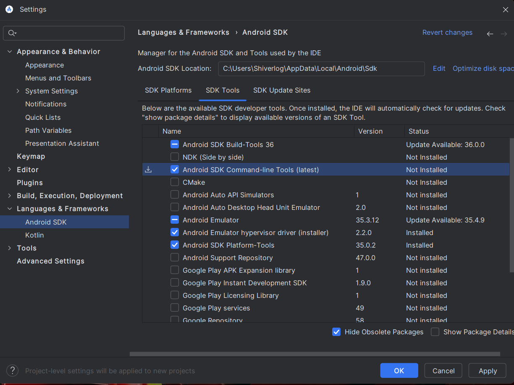

###### - 민시우(2025/03/10) 작성 -

## 1w-3. 🚀 Appium 학습

### [1] Appium 세팅

- [Node.js 다운로드](https://nodejs.org/en/download)
- [Java 17 다운로드](https://www.oracle.com/java/technologies/downloads/?er=221886)
- [Android 다운로드](https://developer.android.com/studio)



##### 환경변수 설정

###### - [Win]+[R] sysdm.cpl

###### - ANDROID_HOME / C:\Users\Shiverlog\AppData\Local\Android\Sdk

###### - Path 추가 값

```
C:\Users\Shiverlog\AppData\Roaming\npm
%ANDROID_HOME%\platform-tools
%ANDROID_HOME%\emulator
%ANDROID_HOME%\cmdline-tools\latest\bin
%ANDROID_HOME%\build-tools\35.0.1
```

###### - JAVA_HOME / D:\Program Files\Java\jdk-17

##### Appium 관련 설치

```sh
# Appium 설치
npm install -g appium
appium driver install uiautomator2
# Android 드라이버 (UIAutomator2) 설치
appium driver install uiautomator2
# iOS 드라이버 (XCUITest) 설치 (Mac 필요)
appium driver install xcuitest
# WebDriver 설치
npm install -g webdriverio
npm install --save-dev @types/webdriverio
# Appium 실행
npx appium
# VS Code에서 환경 변수 다시 로드
refreshenv
```

###### - Appium 설치확인 및 버젼확인

```
node -v
npm -v
java --version
appium -v
```

#### `ADB 데몬 (ADB Daemon)`

##### - ADB (Android Debug Bridge) 데몬은 ADB 서버와 ADB 클라이언트 간의 통신을 처리하는 백그라운드 프로세스로써, 안드로이드 기기와 PC 간의 디버깅 및 파일 전송 등을 가능하게 하는 도구이다.

###### 1. PC ↔ 안드로이드 기기 간 통신을 중계

###### 2. ADB 명령을 기기에서 실행하도록 처리

###### 3. 파일 전송, 로그 확인, 앱 설치/제거 등의 작업 수행

```
# ADB 서버 시작
adb start-server

# ADB 서버 종료
adb kill-server

# ADB 데몬을 루트 권한으로 실행
adb root

# ADB 데몬을 일반 사용자 권한으로 실행
adb unroot

# ADB 데몬을 TCP/IP 모드로 실행 (원격 디버깅)
adb tcpip 5555

# ADB 데몬 다시 시작
adb kill-server
adb start-server

# PC에 연결된 안드로이드 기기의 목록을 확인
adb devices
```

---

### [2] 🚀 웹뷰(WebView)와 네이티브 뷰(Native View) 개념 및 웹 인증 프로세스

##### - ChromeCustomTab (Android) : Android 4.3 이상에서 OAuth/OpenID Connect 인증을 웹 기반으로 실행할 때 사용

##### - ASWebAuthenticationSession (iOS) : iOS 12 이상에서 OAuth/OpenID Connect 인증을 위한 공식 API, Safari 기반 인증을 실행하고, 로그인 후 앱으로 자동 복귀 가능

#### `웹뷰(WebView)`: 네이티브 앱 내부에서 웹 페이지를 로드할 수 있도록 하는 임베디드 브라우저

###### 1. 내부적으로 HTML, CSS, JavaScript로 구성된 웹 페이지를 렌더링

###### 2. 웹 페이지가 포함되어 있기 때문에, 이를 처리하려면 컨텍스트(Context) 전환이 필요

###### 3. Android에서는 WebView, iOS에서는 WKWebView 또는 UIWebView를 사용하여 구현

```ts
// 현재 사용 가능한 모든 컨텍스트 가져오기
const contexts = await driver.getContexts();

// 웹뷰 컨텍스트로 전환
await driver.switchContext(contexts.find(ctx => ctx.includes('WEBVIEW')));

// 웹 요소 조작
const webElement = await driver.findElement('css selector', '#login-button');
await webElement.click();

// 다시 네이티브 컨텍스트로 전환
await driver.switchContext('NATIVE_APP');
```

#### `네이티브 뷰(Native View)`: 모바일 운영체제(Android/iOS)가 제공하는 네이티브 UI 컴포넌트를 의미

##### - 운영체제의 UI 프레임워크(Android의 View, iOS의 UIKit)를 사용하여 렌더링된 화면, Appium에서는 네이티브 뷰 요소를 찾을 때 UiAutomator2 (Android)와 XCUITest (iOS) 엔진을 사용

```ts
// Android에서 네이티브 요소 찾기 (ID 사용)
const element = await driver.findElement("id", "com.example.app:id/button");
await element.click();

// iOS에서 네이티브 요소 찾기 (Accessibility ID 사용)
const element = await driver.findElement("accessibility id", "login_button");
await element.click();
```

---

### [3] 🔍 번외: 개발자도구에서 디버깅

- And : chrome://inspect/#devices
- ios : safari > tab 개발자용
- TS 디버깅을 위해, 소스 맵 활성화 후 웹팩/Webpack 설정에서 "devtool": "source-map" 추가

---

### [4] 📌 Execution Context(명시적 대기 조건 EC)

| 조건명                              | 설명                                                      |
| ----------------------------------- | --------------------------------------------------------- |
| **presenceOfElementLocated**        | 요소가 DOM에 존재할 때까지                                |
| **presenceOfAllElementsLocatedBy**  | 특정 요소가 여러 개 존재할 때까지                         |
| **visibilityOfElementLocated**      | 요소가 DOM에 존재하며 화면에 표시될 때까지                |
| **visibilityOf**                    | 주어진 요소가 화면에 표시될 때까지                        |
| **invisibilityOfElementLocated**    | 요소가 화면에서 사라질 때까지                             |
| **invisibilityOf**                  | 주어진 요소가 화면에서 사라질 때까지                      |
| **stalenessOf**                     | 요소가 더 이상 유효하지 않을 때까지                       |
| **elementToBeClickable**            | 요소가 클릭 가능해질 때까지                               |
| **elementToBeSelected**             | 요소가 선택될 때까지                                      |
| **elementSelectionStateToBe**       | 요소의 선택 상태가 특정 값과 일치할 때까지                |
| **numberOfElementsToBe**            | 특정 개수만큼 요소가 존재할 때까지                        |
| **numberOfElementsToBeMoreThan**    | 특정 개수보다 많아질 때까지                               |
| **numberOfElementsToBeLessThan**    | 특정 개수보다 적어질 때까지                               |
| **textToBePresentInElement**        | 특정 요소의 텍스트가 특정 값과 일치할 때까지              |
| **textToBePresentInElementLocated** | 특정 요소의 텍스트가 특정 값과 일치할 때까지              |
| **textToBePresentInElementValue**   | 특정 요소의 `value` 속성이 특정 값과 일치할 때까지        |
| **attributeToBe**                   | 특정 요소의 속성이 특정 값과 일치할 때까지                |
| **attributeContains**               | 특정 요소의 속성이 특정 값을 포함할 때까지                |
| **titleIs**                         | 현재 페이지의 제목이 특정 값과 일치할 때까지              |
| **titleContains**                   | 현재 페이지의 제목이 특정 값을 포함할 때까지              |
| **urlToBe**                         | 현재 URL이 특정 값과 일치할 때까지                        |
| **urlContains**                     | 현재 URL이 특정 값을 포함할 때까지                        |
| **frameToBeAvailableAndSwitchToIt** | 특정 프레임이 사용 가능해질 때까지                        |
| **numberOfWindowsToBe**             | 열린 브라우저 탭(윈도우) 개수가 특정 개수와 일치할 때까지 |
| **alertIsPresent**                  | 경고창(Alert)이 나타날 때까지                             |
| **and**                             | 여러 개의 조건을 모두 만족할 때까지                       |
| **or**                              | 여러 개의 조건 중 하나라도 만족하면 종료                  |
| **not**                             | 특정 조건이 충족되지 않을 때까지                          |
